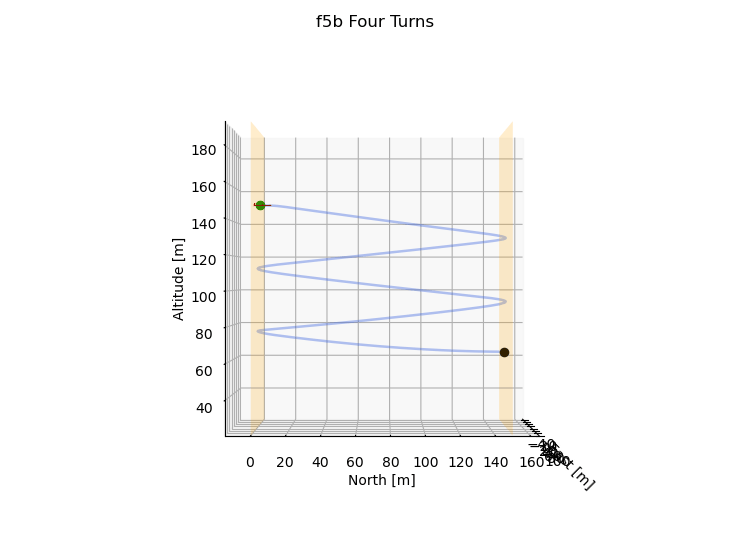

# 6-DOF Glider Trajectory Optimization Simulator

A high-fidelity optimal control framework for autonomous trajectory planning and real-time visualization of F5B glider maneuvers.

<p align="center">
  <br>
  <i>Optimized four-turn F5B pattern, replayed in the 3D viewer.</i><br>
  <a href="videos/f5b_four_turns_3D_live.mp4">Full-resolution video with aircraft mesh →</a>
</p>

## Overview

This is an **EPFL semester project** that develops and optimizes complex aerodynamic trajectories for a 6-degree-of-freedom (6-DOF) radio-controlled sailplane (F5B glider) performing multi-turn competitive flight patterns. 

**Scientific Context**: This work serves as the **6-DOF inner-loop trajectory planner** for a future **aerodynamic co-design pipeline** that extends the co-design framework of [Affinita et al., *Gradient-based Nested Co-Design of Aerodynamic Shape and Control for Winged Robots*](https://arxiv.org/abs/2603.06760) (arXiv:2603.06760) at EPFL. The vision is to jointly optimize airfoil geometry and flight trajectories in 3D. This OCP represents the **trajectory optimization half** of that vision, while the aerodynamic shape optimization (wing/fuselage geometry) forms the complementary half. Together, they enable simultaneous design of airfoil and maneuver for next-generation F5B competition aircraft.

Using **CasADi-based trajectory optimization**, the system computes energy-efficient maneuvers subject to aerodynamic, control, and path constraints, then visualizes results through interactive 3D rendering, geospatial mapping, and cinematic MP4 generation.

### Key Features

- **6-DOF Rigid Body Dynamics**: Full nonlinear aircraft model with body-frame velocities, Euler angles, and inertial position
- **Nonlinear Aerodynamics**: Sigmoid-blended stall model, drag polar, and control surface effectiveness
- **Trajectory Optimization**: Multi-phase optimal control using direct collocation (CasADi + IPOPT)
- **Real-Time Visualization**: Interactive 3D renderer with camera modes, trajectory replay, and live plotting
- **Geospatial Mapping**: Cesium.js integration for real-world terrain and 3D model visualization
- **MP4/GIF Export**: High-quality animation generation for analysis and presentation

---

## Mathematical Formulation

### Optimal Control Problem (OCP)

The trajectory optimization is formulated as a **finite-horizon discrete-time optimal control problem**:

$$\min_{\mathbf{x}, \mathbf{u}, T} \quad J = \sum_{k=0}^{N-1} \ell_k(x_k, u_k) + V_N(x_N) + \phi(T)$$

**subject to:**

$$x_{k+1} = x_k + h_k f(x_k, u_k), \quad k = 0, \ldots, N-1 \quad \text{(dynamics)}$$

$$g(x_k, u_k) \leq 0, \quad k = 0, \ldots, N \quad \text{(state/control constraints)}$$

$$x_0 = x_{\text{init}} \quad \text{(initial condition)}$$

where:
- $x_k \in \mathbb{R}^{12}$ is the state at step $k$
- $u_k \in \mathbb{R}^{4}$ is the control input (elevator, aileron, rudder, throttle/flap)
- $h_k$ is the integration step size for phase $k$
- $f(x, u)$ encodes the 6-DOF aircraft dynamics
- $\ell_k(x, u)$ is the stage cost (defined below)
- $V_N(x_N)$ is the terminal cost
- $\phi(T)$ is a time regularization penalty

### State Vector

$$x = [u, v, w, \, p, q, r, \, \phi, \theta, \psi, \, p_n, p_e, p_d]^{\top}$$

- **Body-frame velocities** (m/s): $u, v, w$
- **Angular rates** (rad/s): $p$ (roll rate), $q$ (pitch rate), $r$ (yaw rate)
- **Euler angles** (rad): $\phi$ (roll), $\theta$ (pitch), $\psi$ (yaw)
- **Inertial position** (m, NED frame): $p_n$ (north), $p_e$ (east), $p_d$ (down)

### Control Vector

$$u_{\text{ctrl}} = [\delta_e, \delta_a, \delta_r, \delta_f]^{\top}$$

- $\delta_e$: elevator deflection (rad)
- $\delta_a$: aileron deflection (rad)
- $\delta_r$: rudder deflection (rad)
- $\delta_f$: flap deflection / throttle (0 to 1 or rad)

### Cost Functions

**Stage Cost** (per phase):

$$\ell_k(x, u_{\text{ref}}) = w_{\text{north}} \left(\frac{p_n - p_{n,\text{ref}}}{P_n}\right)^2 + w_{\text{pitch}} \dot{\theta}_{\text{inertial}}^2 + w_{\text{angular}} (p^2 + q^2 + r^2)$$

where:
- $w_{\text{north}} = 0.025$: north position tracking weight
- $w_{\text{pitch}} = 0.5$: inertial pitch-rate penalty
- $w_{\text{angular}} = 0.0125$: angular rate penalty
- $P_n = 150$ m: north normalization scale
- $\dot{\theta}_{\text{inertial}} = \cos\phi \cdot q - \sin\phi \cdot r$: inertial pitch rate

**Terminal Cost**:

$$V_N(x_N) = w_{\text{term,north}} (p_n - p_n^{\star})^2 + w_{\text{term,angular}} (p_N^2 + q_N^2 + r_N^2)$$

- $w_{\text{term,north}} = 50.0$: terminal north position
- $w_{\text{term,angular}} = 10.0$: terminal angular rate penalty

**Time Penalty**:

$$\phi(T) = w_{\text{time}} \sum_i T_i \quad \text{(encourages fast maneuvers)}$$

### Aerodynamic Model

**Scope**: This optimization models **unpowered slalom legs** — the aerodynamically demanding energy-critical phases of F5B competition where the motor is off and the glider navigates the turning gates. Motor-assisted climbs and cruise segments are excluded from this trajectory planner.

**Dynamic Pressure & Aerodynamic Angles**:

$$q_{\bar{}} = \frac{1}{2}\rho V_a^2, \quad \alpha = \arctan\left(\frac{w}{u}\right), \quad \beta = \arcsin\left(\frac{v}{V_a}\right)$$

**Nonlinear Stall Model** (sigmoid blend):

$$\sigma(\alpha) = \frac{1 + e^{-M(\alpha - \alpha_0)} + e^{M(\alpha + \alpha_0)}}{(1 + e^{-M(\alpha - \alpha_0)})(1 + e^{M(\alpha + \alpha_0)})}$$

$$C_L(\alpha) = (1-\sigma) \cdot (C_{L_0} + C_{L_\alpha}\alpha) + \sigma \cdot 2\text{sgn}(\alpha)\sin^2(\alpha)\cos(\alpha)$$

$$C_D(\alpha) = C_{D_p} + \frac{(C_{L_0} + C_{L_\alpha}\alpha)^2}{\pi e \cdot \text{AR}}$$

---

## Project Structure

```
6dof-glider-sim/
├── OCP/                          # Optimal control problem formulation
│   ├── f5b_four_turns.py        # 4-turn trajectory optimization (main entry)
│   ├── f5b_two_turns.py         # 2-turn trajectory optimization
│   └── dynamics_integrator.py   # CasADi 6-DOF dynamics and RK4 integrator
│
├── params/                       # Aircraft and simulation parameters
│   ├── params.py                # Aerodynamic coefficients, mass properties
│   ├── dynamics.py              # State initialization, aero functions
│   └── __init__.py
│
├── trajectory/                   # Trajectory utilities
│   ├── trajectory_guess/        # Initial guess generation
│   │   └── f5b.py               # Multi-phase trajectory interpolation
│   └── warm_start/              # Pre-computed warm-start solutions (.npy)
│
├── utils/                        # Visualization and analysis tools
│   ├── live_plot.py             # Interactive 3D matplotlib animation + GIF export
│   ├── live_plot_mp4.py         # MP4 video generation (f5b_glider_v2.stl rendering)
│   ├── cost_breakdown.py        # Cost component visualization
│   ├── side_top_plot.py         # 2D side/top view plots
│   └── export_czml.py           # Cesium CZML trajectory export
│
├── cruise_misile/               # 3D rendering engine (OpenGL/ModernGL)
│   ├── aircraft/                # Mesh generation and parameters
│   │   ├── assembly.py          # Aircraft assembly pipeline
│   │   ├── fuselage.py          # Fuselage parametric geometry
│   │   ├── wing.py              # Wing parametric geometry
│   │   ├── tail.py              # Tail parametric geometry
│   │   └── parameters.py        # Aerodynamic + structural parameters
│   ├── geometry/                # Mesh primitives and operations
│   │   ├── mesh.py              # Mesh class (vertices, faces, normals)
│   │   └── primitives.py        # Cone, cylinder, flat-plate primitives
│   └── rendering/               # OpenGL renderer
│       ├── renderer.py          # Main render loop, camera control
│       ├── camera.py            # Camera modes (FOLLOW, OVERVIEW, ORBIT)
│       ├── shaders.py           # GLSL vertex/fragment shaders
│       ├── ui.py                # On-screen overlay (FPS, state display)
│       └── types.py             # TypedDict definitions
│
├── analysis/                     # Post-optimization analysis
│   ├── analysis_four_turns.py   # 4-turn result extraction & cost breakdown
│   └── analysis_two_turns.py    # 2-turn result extraction & cost breakdown
│
├── open_loop_tests/             # Validation and testing
│   ├── open_loop_test.py        # Trajectory playback and stability check
│   ├── level_flight_trim_solve_no_propeller.py  # Trim state computation
│   └── pertubation_check.py     # Sensitivity analysis
│
├── plots/                       # Generated plots and animations
│   └── f5b/                     # Four-turn case results
│       ├── f5b_four_turns_3D_live.gif        # 3D trajectory animation
│       ├── f5b_four_turns_side_view.png      # Side projection
│       ├── f5b_four_turns_top_view.png       # Top projection
│       └── f5b_four_turns_cost_breakdown.png # Cost component analysis
│
├── videos/                      # MP4 animations (high resolution)
│   └── f5b_four_turns_3D_live.mp4
│
├── main.py                      # Interactive 3D renderer entry point
├── cesium_viewer.html           # Geospatial visualization (Cesium.js)
├── trajectory_four_turns.czml   # Cesium trajectory file (KML-like format)
├── f5b_glider_v2.stl           # 3D mesh for rendering (stereolithography)
├── Jas 39 gripen Geneva lake 2.0.mp4  # Reference flight (external data)
└── LICENSE                      # Project license
```

---

## Quick Start

### Installation

```bash
# Clone repository
git clone <repo-url>
cd 6dof-glider-sim

# Create conda environment
conda create -n glider python=3.11 -y
conda activate glider

# Install dependencies
pip install numpy scipy matplotlib casadi pillow trimesh pyopengl moderngl
```

### Run 4-Turn Trajectory Optimization

```bash
python OCP/f5b_four_turns.py
```

This will:
1. Load or generate an initial trajectory guess
2. Solve the 4-turn optimal control problem (~5–10 min on modern CPU)
3. Save warm-start solution to `trajectory/warm_start/`
4. Generate 3D live GIF animation
5. Generate MP4 video with STL mesh rendering
6. Print cost breakdown and convergence statistics

**Output files**:
- `plots/f5b/f5b_four_turns_3D_live.gif` — 3D trajectory animation
- `videos/f5b_four_turns_3D_live.mp4` — High-res video with aircraft mesh
- `plots/f5b/f5b_four_turns_side_view.png` — 2D projections
- `plots/f5b/f5b_four_turns_cost_breakdown.png` — Cost analysis

### Interactive 3D Renderer

```bash
python main.py
```

Controls:
- **Arrow Keys** / **WASD**: Translate camera
- **U/J**: Pitch camera up/down
- **Left Mouse Drag**: Orbit camera
- **Tab**: Cycle camera mode (FOLLOW → OVERVIEW → ORBIT)
- **Space**: Pause/Resume
- **R**: Replay trajectory
- **Esc**: Quit

### Geospatial Visualization (Cesium)

Open `cesium_viewer.html` in a web browser to visualize the 4-turn trajectory on a 3D globe with terrain. The viewer loads trajectory data from `trajectory_four_turns.czml` and can display the aircraft mesh orientation at each waypoint.

---

## Key Results: Four-Turn Maneuver

### Trajectory Overview

The **four-turn maneuver** is a competitive F5B flight pattern alternating between northbound and southbound passes:

- **Total Duration**: ~125 s (time-optimal)
- **Altitude**: 100–150 m (AGL)
- **Track**: North (0 m) → South (150 m) → North (0 m) → South (150 m) → North (0 m)
- **Turn Radius**: ~40–60 m per coordinated turn

### Cost Breakdown

The optimization balances multiple objectives:

| Component | Weight | Contribution |
|-----------|--------|--------------|
| North position tracking | 0.025 | Guides turns to waypoints |
| Pitch rate (inertial) | 0.5 | Minimizes bobbing / over-pitching |
| Angular rate penalty | 0.0125 | Encourages smooth maneuvers |
| Terminal north | 50.0 | Enforces final waypoint arrival |
| Terminal angular rate | 10.0 | Ensures stable final state |

### Visualization Outputs

**3D Trajectory Animation**: Interactive 3D animation of the optimized four-turn trajectory with STL aircraft mesh rendering.

**Cost Breakdown**: Per-phase cost component analysis showing dominant penalties.

**Side View**: Altitude and vertical rate profile through the maneuver.

**Top View**: Plan-view ground track showing north/south leg alignment and turn geometry.

### Video Export

High-resolution MP4 animation with realistic 3D aircraft mesh:

```bash
# Generates ~1080p MP4 with FFmpeg
# See: videos/f5b_four_turns_3D_live.mp4
```

---

## In-World Simulation: Cesium Geospatial Viewer

The project includes integration with **Cesium.js**, a powerful open-source 3D geospatial visualization framework. This enables:

- **Real-world terrain**: Display trajectories over actual satellite imagery and elevation models
- **3D model visualization**: Render the F5B glider mesh at each waypoint with correct orientation
- **Multi-trajectory comparison**: Overlay two-turn and four-turn solutions
- **Inspection tools**: Click to query altitude, heading, airspeed at any point

### Using Cesium Viewer

> **A Cesium Ion access token is required.** Terrain and imagery are served by Cesium Ion.
> Create a free token at [ion.cesium.com/tokens](https://ion.cesium.com/tokens) and replace
> `YOUR_CESIUM_ION_ACCESS_TOKEN` near the top of the `<script>` block in `cesium_viewer.html`.
> Without it the globe renders blank.

1. Open `cesium_viewer.html` in a modern web browser (Chrome, Firefox, Edge)
2. The viewer automatically loads `trajectory_four_turns.czml` (CZML = Cesium Language Format)
3. Use mouse controls to pan, rotate, zoom
4. Hover over trajectory points to inspect state data

**Example Export** (from trajectory analysis):

```python
from utils.export_czml import export_trajectory_to_czml
export_trajectory_to_czml(
    pn, pe, alt, phi, theta, psi, time_mesh,
    output_file="trajectory_four_turns.czml"
)
```

---

## Reference Flight: Jas 39 Gripen Geneva Lake 2.0

The repository includes an external reference video for comparison:

**`Jas 39 gripen Geneva lake 2.0.mp4`** — A real F5B sailplane (Jas 39 Gripen model) flying a similar multi-turn pattern over Lake Geneva. This video provides:

- **Ground truth flight behavior**: Real-world energy management and control input sequences
- **Turn geometry reference**: Measured bank angles (~30–45°), turn radii (~40–60 m), and coordinated turn strategies
- **Feasibility validation**: Confirms that the optimized trajectories lie within the envelope of actual F5B flight
- **Aeroacoustic signature**: Wind and stall sounds that inform control authority assessment
- **Pilot technique**: Demonstrates effective flap usage, speed braking, and pitch trim during transitions

This reference flight is crucial for:
1. **Model validation**: Comparing simulated vs. observed lift/drag
2. **Constraint tuning**: Establishing realistic control deflection limits
3. **Cost function design**: Inferring human flight objectives (smoothness, efficiency, timing)
4. **Performance benchmarking**: Setting target lap times and energy expenditure

---

## Advanced Usage

### Warm-Start Solutions

The first optimization typically requires 5–10 minutes. Subsequent runs use warm-start trajectories:

```python
# In OCP/f5b_four_turns.py, line ~310:
warm_start = r"trajectory/warm_start/f5b_four_turns_w_sol_warm_start.npy"
# solver is initialized with previous solution → converges in 1–2 minutes
```

### Multi-Phase Cost Tuning

Modify weights in `OCP/f5b_four_turns.py` to prioritize different objectives:

```python
w_north = 0.1 / 4              # Increase to enforce tighter waypoint tracking
w_pitch_rate = 1.0 / 2         # Increase to reduce pitch oscillations
w_angular = 0.025 / (2 * 100)  # Increase to smooth bank/yaw transitions
w_time = 0.50                  # Increase to prioritize speed over smoothness
```

### Custom Aircraft Models

Modify aerodynamic coefficients in `params/params.py`:

```python
CL_0 = 0.33           # Zero-lift coefficient
CL_alpha = 4.41       # Lift slope (rad^-1)
CD_p = 0.03           # Profile drag
AR = 9.5              # Aspect ratio
e = 0.95              # Oswald efficiency factor
```

### Trajectory Constraints

Add custom constraints in the OCP formulation:

```python
# Example: limit bank angle
g.append(phi[k] <= np.radians(45))  # max 45° bank

# Example: minimum altitude
g.append(alt[k] >= 50)               # min 50 m AGL
```

---

## Performance & Scalability

| Metric | Value |
|--------|-------|
| **Mesh Vertices (F5B STL)** | ~500 |
| **Discretization Points (4-turn)** | 390 |
| **Decision Variables (NLP)** | 6,240 |
| **Convergence Time (warm-start)** | 1–2 min |
| **Animation Frame Rate** | 30 fps (MP4) |
| **Video File Size** | ~50–100 MB |

---

## Troubleshooting

### Optimization fails to converge

- **Cause**: Initial guess too far from feasible region
- **Solution**: Reduce waypoint offsets in `trajectory_guess/f5b.py` or loosen constraints

### MP4 generation error "ffmpeg not found"

- **Cause**: FFmpeg not on system PATH
- **Solution**: Install FFmpeg (Windows: `winget install Gyan.FFmpeg`) or set path in `live_plot_mp4.py`

### Cesium viewer shows blank map

- **Cause**: missing Cesium Ion access token, incorrect CZML file path, or a network issue
- **Solution**: Set your own token in `cesium_viewer.html` (see [Using Cesium Viewer](#using-cesium-viewer)); ensure `trajectory_four_turns.czml` exists in repo root; check browser console for errors

---

## References & Theory

1. **Beard, R. W., & McLain, T. W.** (2012). *Small Unmanned Aircraft: Theory and Practice*. Princeton University Press.
   - Chapter 4: Aerodynamic forces and moments

2. **Wächter, A., & Biegler, L. T.** (2006). "On the implementation of a primal-dual interior point filter line search algorithm for large-scale nonlinear programming." *Mathematical Programming*, 106(1), 25–57.
   - IPOPT solver theory

3. **Andersson, J. A. E., Gillis, J., Horn, G., Rawlings, J. B., & Diehl, M.** (2019). "CasADi – a software framework for nonlinear optimization and optimal control." *Mathematical Programming Computation*, 11, 1–36.
   - CasADi optimal control formulation

4. **FAI Sporting Code, Section 4C** — F5B Glider Racing Rules (reference for competitive flight patterns)

---

## Authors & Acknowledgments

**Project**: EPFL Semester Project, Spring 2026

**Supervisors**:
- Mingda Xu, [Computer Vision Lab (CVL)](https://www.epfl.ch/labs/cvlab/) — EPFL
- Rudolf Reiter, [Robotics and Perception Group](https://www.inf.ics.ifi.uzh.ch/perception/) — UZH

**Scientific Motivation**: This work is motivated by and extends the aerodynamic co-design framework of Daniele Affinita, Mingda Xu, Benoît Valentin Gherardi and Pascal Fua, *[Gradient-based Nested Co-Design of Aerodynamic Shape and Control for Winged Robots](https://arxiv.org/abs/2603.06760)* (arXiv:2603.06760, EPFL), which jointly optimizes airfoil shapes and flight trajectories in the planar setting. This project is the 3D trajectory optimization component of the larger vision.

**Built with**:
- **CasADi** for optimal control
- **NumPy/SciPy** for numerics
- **Matplotlib** for 2D plotting
- **ModernGL** for OpenGL rendering
- **Cesium.js** for geospatial visualization
- **Trimesh** for STL mesh handling

---

## License

See [LICENSE](LICENSE) file for details.

---

**Last Updated**: May 2026  
**Repository**: [6dof-glider-sim](.)